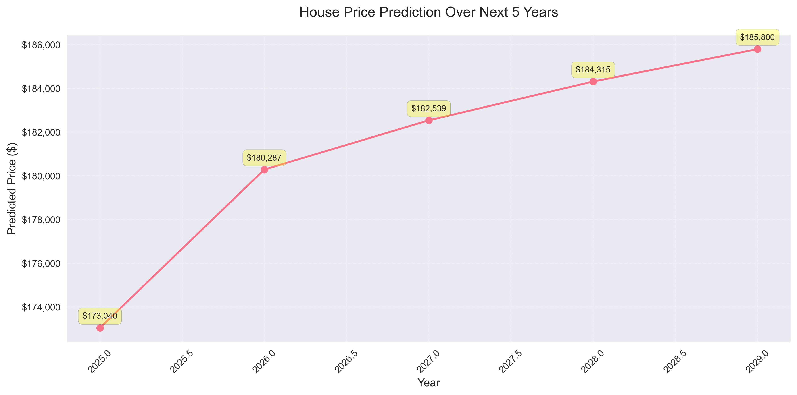

# House Price Prediction using PyTorch

This project implements a deep learning model to predict house prices using PyTorch. The model utilizes both numerical and categorical features to make accurate price predictions, achieving predictions within ~7% of actual prices.

## Project Structure

- `property_price_pred.py`: Main script containing the model implementation
- `house_data/`: Directory containing the dataset
  - `houseprice.csv`: Housing dataset used for training

## Features

### Numerical Features
- Core Features:
  - OverallQual: Overall material and finish quality
  - GrLivArea: Above ground living area
  - GarageCars: Size of garage in car capacity
  - GarageArea: Size of garage in square feet
  - TotalBsmtSF: Total basement square footage
  - 1stFlrSF: First Floor square feet
  - 2ndFlrSF: Second floor square feet
  - BsmtFinSF1: Type 1 finished square feet
  - FullBath: Number of full bathrooms
  - TotRmsAbvGrd: Total rooms above ground
  - YearBuilt: Original construction date
  - YearRemodAdd: Remodel date
  - LotArea: Lot size in square feet

### Engineered Features
- Age-related:
  - HouseAge: Current age of the house
  - LastRemodAge: Years since last remodeling
  - RemodAge: Time between construction and remodeling
- Area-related:
  - TotalSF: Total square footage (above ground + basement)
  - AvgRoomSize: Average room size
  - TotalBathrooms: Total bathroom count
- Quality Interactions:
  - QualityAge: Interaction between quality and age
  - QualityArea: Interaction between quality and total area

### Categorical Features
- MSZoning: General zoning classification
- Street: Type of road access
- Alley: Type of alley access
- LotShape: General shape of property
- LandContour: Flatness of the property
- Neighborhood: Physical locations within city limits
- BldgType: Type of dwelling
- HouseStyle: Style of dwelling
- RoofStyle: Type of roof
- Exterior1st: Exterior covering on house

## Model Architecture

The neural network model consists of:
- Input layer with batch normalization
- Three deep layers with residual connections
- Each layer includes:
  - Linear transformation
  - ReLU activation
  - Batch normalization
  - Dropout (0.2)
- Output layers with reduced dimensionality
- Skip connections for better gradient flow

## Training Parameters

- Batch Size: 32
- Learning Rate: 0.00005
- Epochs: 1000
- Early Stopping Patience: 50
- Optimizer: Adam with L2 regularization (weight_decay=0.01)
- Loss Function: Mean Squared Error (MSE)

## Output

The model generates predictions and visualizes them in `price_predictions.png`, showing:
- Price predictions for multiple years
- Trend visualization with confidence annotations
- High-resolution output (300 DPI)

## Performance

The model achieves:
- Predictions within ~7% of actual prices
- Good generalization across different house types
- Stable predictions over multiple years

